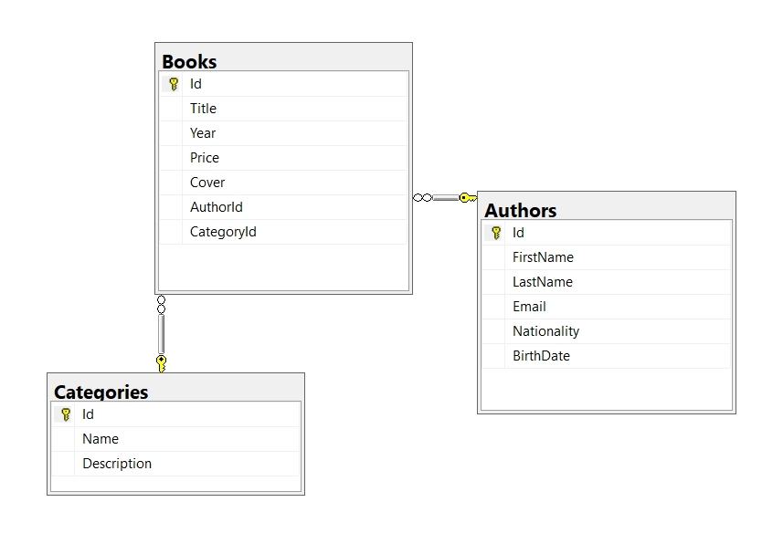

# 📚 Books Management API

A RESTful Web API built with **ASP.NET Core** and **Entity Framework Core** for managing books, authors, and categories. This project supports full CRUD operations, file uploads, and advanced filtering.

---

## 📋 Project Overview

This API powers a digital library system with the following core functionalities:

- **📘 Books Management**  
  Add, retrieve, update, and delete books. Supports cover image uploads and links to authors and categories.

- **✍️ Authors Management**  
  Full CRUD operations to manage author details and their related books.

- **🗂️ Categories Management**  
  Create, update, and delete categories to organize books efficiently.

- **🔍 Advanced Filtering**  
  Filter and search books by author, category, and other criteria with pagination support.


## 🏗️ Architecture

The project follows a clean architecture pattern with the following layers:

- **Controllers** – Handle HTTP requests and return responses.
- **Services** – Contain business logic and communicate with the data layer.
- **Data** – Holds Entity Framework Core models and the database context.
- **DTOs** – Data Transfer Objects used to structure request/response data.
- **Helpers** – Reusable configuration like AutoMapper profiles.

---

## 🛠️ Technologies Used

- **Framework**: ASP.NET Core 8.0+
- **ORM**: Entity Framework Core
- **Mapping**: AutoMapper
- **Database**: SQL Server (configurable via `appsettings.json`)
- **API Documentation**: Swagger / OpenAPI
- **Dependency Injection**: ASP.NET Core built-in DI container

---

## 📁 Project Structure


```
CRUD/
├── Controllers/ # API endpoints
│ ├── AuthorsController.cs
│ ├── BooksController.cs
│ └── CategoriesController.cs
│
├── Data/ # EF Core models and DB context
│ ├── Models/
│ │ ├── Author.cs
│ │ ├── Book.cs
│ │ └── Category.cs
│ └── ApplicationDbContext.cs
│
├── Dtos/ # Data Transfer Objects
│ ├── AuthorDto.cs
│ ├── BookDto.cs
│ ├── BookDetailsDto.cs
│ └── CategoryDto.cs
│
├── Helpers/ # Mapping configurations
│ └── MappingProfile.cs
│
├── Migrations/ # EF Core migrations
│ ├── <timestamp>_init.cs
│ └── ApplicationDbContextModelSnapshot.cs
│
├── Services/ # Business logic layer
│ ├── AuthorsService.cs
│ ├── BooksService.cs
│ ├── CategoriesService.cs
│ ├── IAuthorsService.cs
│ ├── IBooksService.cs
│ └── ICategoriesService.cs
│
├── GlobalUsings.cs # Global using directives
├── Program.cs # App entry and DI setup
├── appsettings.json # Configuration file
└── CRUD.http # HTTP request samples for testing

```

## 🚀 Getting Started

### Prerequisites

- .NET 8.0 SDK or later
- SQL Server (LocalDB, Express, or Full)
- Visual Studio 2022 or VS Code

### Installation

1. **Clone the repository**
   ```bash
   git clone https://github.com/ShroukOuda/C.R.U.D.git
   cd C.R.U.D
   ```

2. **Restore NuGet packages**
   ```bash
   dotnet restore
   ```

3. **Update connection string**
   
   Edit `appsettings.json` and update the connection string:
   ```json
   {
     "ConnectionStrings": {
       "DefaultConnection": "Server=(localdb)\\mssqllocaldb;Database=BooksManagementDB;Trusted_Connection=true;MultipleActiveResultSets=true"
     }
   }
   ```

4. **Apply database migrations**
   ```bash
   dotnet ef database update
   ```

5. **Run the application**
   ```bash
   dotnet run
   ```

6. **Access the API**
   - API Base URL: `https://localhost:7xxx` or `http://localhost:5xxx`
   - Swagger UI: `https://localhost:7xxx/swagger`

## 📚 API Endpoints

### Books
- `GET /api/books` - Get all books with optional filtering
- `GET /api/books/{id}` - Get a specific book by ID
- `GET /api/books/category/{categoryId}` - Get books that belong to a specific category
- `GET /api/books/author/{authorId}` - Get books written by a specific author
- `POST /api/books` - Create a new book
- `PUT /api/books/{id}` - Update an existing book
- `DELETE /api/books/{id}` - Delete a book

### Authors
- `GET /api/authors` - Get all authors
- `GET /api/authors/{id}` - Get a specific author by ID
- `POST /api/authors` - Create a new author
- `PUT /api/authors/{id}` - Update an existing author
- `DELETE /api/authors/{id}` - Delete an author

### Categories
- `GET /api/categories` - Get all categories
- `GET /api/categories/{id}` - Get a specific category by ID
- `POST /api/categories` - Create a new category
- `PUT /api/categories/{id}` - Update an existing category
- `DELETE /api/categories/{id}` - Delete a category

## 📝 Sample API Usage

### 📘 Create a New Book

```http
POST /api/books
Content-Type: multipart/form-data

| Key          | Value                                                    |
| ------------ | -------------------------------------------------------- |
| `title`      | `Clean Code: A Handbook of Agile Software Craftsmanship` |
| `year`       | `2008`                                                   |
| `price`      | `45.99`                                                  |
| `authorId`   | `3`                                                      |
| `categoryId` | `4`                                                      |
| `cover`      | *(Upload a valid `.jpg` or `.png` file)*                 |

```

### Get books with filtering
```http
GET /api/books?category=Programming&author=Robert Martin
```

## 🔧 Configuration

Key configuration options in `appsettings.json`:

```json
{
  "ConnectionStrings": {
    "DefaultConnection": "your-connection-string"
  },
  "Logging": {
    "LogLevel": {
      "Default": "Information",
      "Microsoft.AspNetCore": "Warning"
    }
  },
  "AllowedHosts": "*"
}
```

## 🧪 Testing

Run the test suite:
```bash
dotnet test
```

For manual testing, use the integrated Swagger UI at `/swagger` endpoint.

## 📊 Database Schema

The database consists of three main entities with the following relationships:

### Entity Relationships

- **One-to-Many**: One Author can write multiple Books  
- **One-to-Many**: One Category can contain multiple Books  
- **Many-to-One**: Each Book belongs to one Author and one Category  

### ER Diagram



## 🤝 Contributing

1. Fork the repository
2. Create a feature branch (`git checkout -b feature/amazing-feature`)
3. Commit your changes (`git commit -m 'Add some amazing feature'`)
4. Push to the branch (`git push origin feature/amazing-feature`)
5. Open a Pull Request


**Built with ❤️ using ASP.NET Core**
